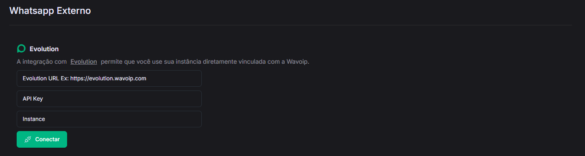

# Evolution

## Começando a integração

Insira as seguintes crêdenciais da Evolution no painel da Wavoip.

Evolution URL (https://seu-evolution.com.br) DNS da sua aplicação do evolution

API Key:  (xxxxxxxxxxxx) Api key durante a sua instalação do evolution

Instance: (5511999999999) Número da instância

Caso não consiga alguma dessas informações entre em contato com a equipe da Evolution.

<figure><figcaption></figcaption></figure>

## Considerações importantes

Não conecte dois dispositivos Wavoip diferentes na mesma conexão Evolution, isso causará conflito entre as sessões.

Se precisar transferir a conexão, desconecte antes de conectar na nova.

## Tudo pronto, seu dispositivo está preparado!

