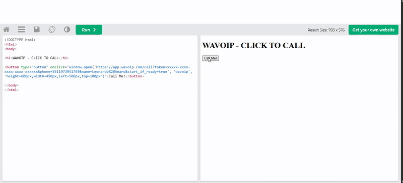

# Click To Call

## Oque é o Click to Call?

O Click to Call é um módulo que possibilita a realização de chamadas via WhatsApp diretamente pelo navegador, utilizando uma URL específica. Este recurso é amplamente utilizado por empresas que desejam integrar chamadas via WhatsApp em seus sistemas de maneira prática e eficiente.

O principal objetivo do Click to Call é permitir que o usuário efetue uma ligação para um número específico com um único clique, evitando processos manuais e facilitando a comunicação. Essa funcionalidade é especialmente útil para integrações em sistemas de CRM, atendimento ao cliente e outras aplicações que envolvam contato direto com o usuário.

## [Teste você mesmo](https://app.wavoip.com/call)

<figure><figcaption></figcaption></figure>
