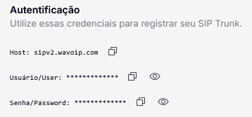
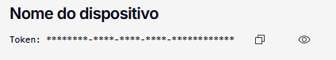

# Autenticação

## Via conta Wavoip

Você pode obter as informações de conexão através da [página do dispositivo](https://app.wavoip.com/devices) e acessar a página de configuração SIP no menu lateral.

<figure><figcaption></figcaption></figure>

Com esse método de autenticação, você deve passar o CallerID como o número de telefone conectado. Ele deve estar igual ao que aparece conectado na página do dispositivo.&#x20;

Caso o CallerID esteja incorreto, você receberá uma resposta com status 404.

## Via token do dispositivo

Você pode conectar também usando o token do dispositivo como Usuário, Senha e CallerID do tronco SIP, disponível na página principal do dispositivo.

<figure><figcaption></figcaption></figure>

