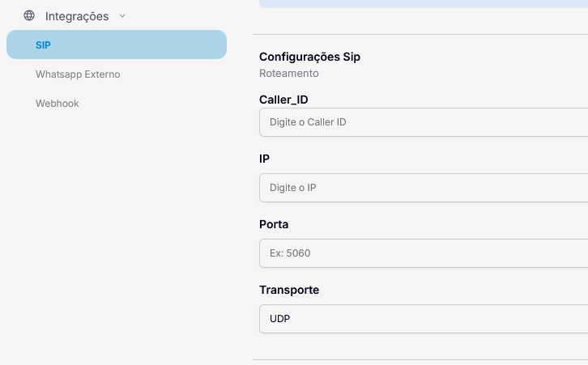

# Centrais sem REGISTER

Algumas centrais, como a Retell AI, não enviam pacotes REGISTER, impossibilitando o direcionamento convencional de chamadas.

Como solução, a Wavoip oferece também o roteamento de chamadas via IP/Porta.

Acessando a [página do dispositivo](https://app.wavoip.com/devices), você pode configurar o direcionamento através do menu SIP, utilizando as informações obtidas com o fornecedor PBX de sua escolha.

<figure><figcaption></figcaption></figure>
